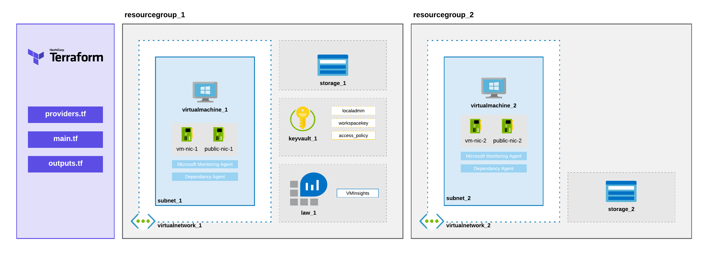
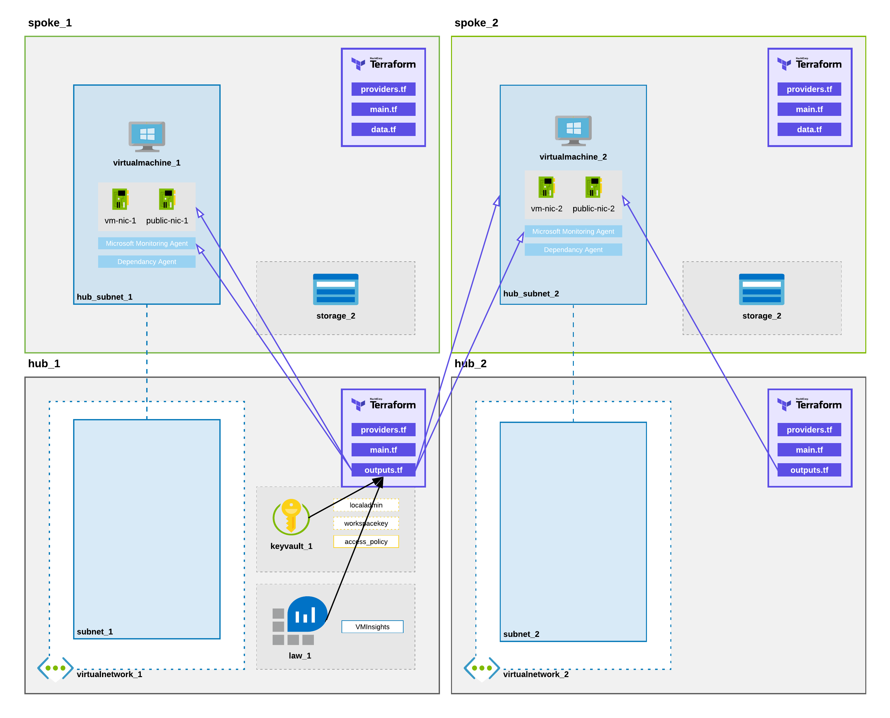

# EP4: Build an Azure Lab with Terraform
## single-deploy
This is a simplied Terraform deployment, where by all the configuration files are within the single folder i.e. a Terraform workspace. The following diagram shows all the components that will be deployed!

# multi-deploy
This is a multi workspace Terraform deployment. The deployment has been split into a hub and spoke deployment, where by the networking and platform related sevices are stored in hub 01. Outputs are used in the hubs to output the platform resource information. The spokes use remote state look ups back into the hub to bind or consume the services in the hubs. This deployment method contains 4 workspaces and will need to be manually deployed in sequence with the hubs and then the spokes to follow. The following diagram shows all the components that will be deployed!

**Note: The deployments use random location generated and this may cause issues if you have a resource group in a region and trying to deploying a nic in another region. If you wanted to fix this, you will have to pin the random location to a single location, rather than the two regions!**